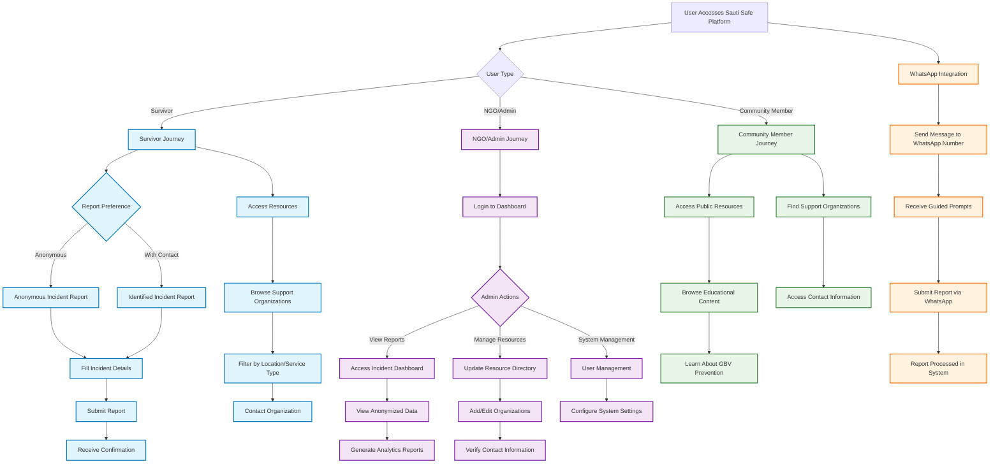
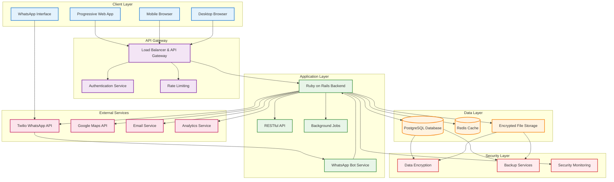

# Sauti Safe App  

**Empowering Survivors, Amplifying Voices.**  

The **Sauti Safe App** is a secure and user-friendly Software-as-a-Service (SaaS) platform designed to empower survivors of gender-based violence (GBV) by providing a confidential way to report incidents and access resources. Our mission is to create a world where survivors feel heard and supported, and communities are equipped to respond effectively to GBV.  


---

## Table of Contents  
1. [About the Project](#about-the-project)
2. [User Journey](#user-journey)
3. [Features](#features)  
4. [Target Audience](#target-audience)
5. [Technologies](#technologies)  
6. [Getting Started](#getting-started)  
7. [Usage](#usage)
8. [Platform Architecture](#platform-architecture)
9. [Contributing](#contributing)  
10. [License](#license)  
11. [Acknowledgments](#acknowledgments)  

---

## About the Project

Sauti Safe addresses the critical need for accessible, secure, and anonymous reporting mechanisms for gender-based violence incidents. The platform serves as a bridge between survivors seeking help and organizations providing support, while maintaining the highest standards of privacy and security.

### Mission
To create a world where survivors feel heard and supported, and communities are equipped to respond effectively to GBV through technology-enabled solutions.

### Vision
A future where technology empowers every survivor to safely report incidents and access the support they need, while enabling organizations to respond more effectively to gender-based violence in their communities.

---

## User Journey

The Sauti Safe platform serves multiple user types, each with distinct needs and interaction patterns. Below is a comprehensive view of how different users interact with the system:



### Key User Flows

#### 1. Survivor Reporting Flow
- **Entry Point**: Web app or WhatsApp
- **Options**: Anonymous or identified reporting
- **Process**: Guided form completion with location, incident type, and description
- **Outcome**: Secure submission with confirmation and resource recommendations

#### 2. Resource Access Flow
- **Entry Point**: Platform resource section
- **Process**: Search and filter support organizations by location and service type
- **Outcome**: Direct contact information and service details

#### 3. NGO/Admin Management Flow
- **Entry Point**: Administrative dashboard login
- **Capabilities**: View anonymized reports, manage resources, generate insights
- **Outcome**: Data-driven decision making for intervention and support

#### 4. WhatsApp Integration Flow
- **Entry Point**: WhatsApp message to dedicated number
- **Process**: Bot-guided incident reporting through conversational interface
- **Outcome**: Seamless report submission without app installation

---

## Features  

### 🔒 Security & Privacy
- **Anonymous Incident Reporting**: Survivors can report incidents securely without revealing their identity
- **End-to-End Encryption**: All data is encrypted both in transit and at rest
- **Privacy-First Design**: No personal data is required for basic platform access
- **Secure Authentication**: Multi-factor authentication for administrative users

### 📱 Multi-Platform Access
- **Progressive Web App (PWA)**: Works seamlessly across desktop and mobile browsers
- **No Download Required**: Instant access without app store installations
- **Responsive Design**: Optimized experience across all device sizes
- **Offline Capabilities**: Basic functionality available without internet connection

### 💬 WhatsApp Integration
- **Conversational Reporting**: Submit reports through familiar WhatsApp interface
- **Guided Prompts**: Bot-assisted form completion for ease of use
- **24/7 Availability**: Report incidents anytime through WhatsApp
- **Language Support**: Multi-language bot interactions

### 📊 Analytics & Insights
- **Anonymized Dashboards**: Aggregate data visualization for NGOs and stakeholders
- **Trend Analysis**: Identify patterns and hotspots for targeted interventions
- **Custom Reports**: Generate specific analytics for funding and program reports
- **Data Export**: Secure export capabilities for further analysis

### 🌍 Accessibility & Localization
- **Multi-Language Support**: Interface available in local languages
- **Accessibility Compliance**: WCAG 2.1 compliant design
- **Low-Bandwidth Optimization**: Works on slow internet connections
- **Inclusive Design**: Developed with diverse user needs in mind

### 🏥 Resource Management
- **Comprehensive Directory**: Curated list of support organizations and services
- **Location-Based Search**: Find nearby resources using GPS or manual location entry
- **Verified Contacts**: Regular verification of organization contact information
- **Service Categorization**: Filter resources by type of support needed

---

## Target Audience

### Primary Users

#### 👥 **Survivors of Gender-Based Violence**
- Individuals seeking safe, anonymous ways to report incidents
- People looking for support resources and organizations
- Users preferring digital platforms over traditional reporting methods

#### 🏢 **NGOs and Support Organizations**
- Organizations providing GBV support services
- Groups needing data insights for program development
- Agencies requiring secure incident tracking systems

#### 🏛️ **Government Agencies and Policymakers**
- Departments working on GBV prevention and response
- Agencies needing aggregate data for policy decisions
- Organizations implementing community-based interventions

### Secondary Users

#### 👨‍👩‍👧‍👦 **Community Members**
- Individuals seeking to learn about GBV prevention
- Community leaders looking for educational resources
- Family and friends supporting survivors

#### 👩‍💼 **Researchers and Advocates**
- Academic researchers studying GBV trends
- Advocacy groups needing data for campaigns
- International organizations monitoring GBV globally

---

## Technologies  

The Sauti Safe App is built using modern, scalable technologies that prioritize security and user experience:

### Frontend Stack
- **Framework**: Progressive Web App (PWA) architecture
- **Styling**: Tailwind CSS for responsive, mobile-first design
- **Performance**: Optimized for low-bandwidth environments
- **Accessibility**: WCAG 2.1 compliant components

### Backend Infrastructure
- **Framework**: Ruby on Rails 7.x
- **API Design**: RESTful APIs with JSON responses
- **Authentication**: Devise gem with custom security enhancements
- **Background Jobs**: Sidekiq for asynchronous processing

### Database & Storage
- **Primary Database**: PostgreSQL with advanced security configurations
- **Data Encryption**: AES-256 encryption for sensitive data
- **Backup Strategy**: Automated encrypted backups
- **Compliance**: GDPR and data protection law compliant

### Third-Party Integrations
- **WhatsApp Business API**: Twilio API for messaging integration
- **Mapping Services**: Google Maps API for location-based features
- **Email Services**: Secure email delivery for notifications
- **Analytics**: Privacy-focused analytics tools

### Security & Privacy
- **Encryption**: End-to-end encryption for all sensitive communications
- **Authentication**: Multi-factor authentication for admin users
- **Privacy**: Zero-knowledge architecture where possible
- **Monitoring**: Security monitoring and incident response systems

### DevOps & Deployment
- **Hosting**: Cloud infrastructure with high availability
- **SSL/TLS**: Full HTTPS encryption with certificate pinning
- **Monitoring**: Application performance and uptime monitoring
- **Backups**: Automated daily backups with disaster recovery

---

## Platform Architecture



### Architecture Principles

#### 1. **Privacy by Design**
- Minimal data collection with user consent
- Anonymous reporting capabilities
- Data encryption at rest and in transit

#### 2. **Scalability**
- Microservices-ready architecture
- Horizontal scaling capabilities
- Efficient caching strategies

#### 3. **Security First**
- Zero-trust security model
- Regular security audits and penetration testing
- Compliance with international privacy standards

#### 4. **Accessibility**
- Multi-platform compatibility
- Low-bandwidth optimization
- Offline-first capabilities where possible

---

## Getting Started  

### 🌐 Accessing the Platform

The Sauti Safe App is designed for immediate access without complex setup:

#### **Option 1: Web Application**
1. Visit **[https://sautisafe.org](https://sautisafe.org)** in any modern web browser
2. The platform works immediately - no downloads or installations required
3. Available on desktop, tablet, and mobile devices

#### **Option 2: WhatsApp Integration**
1. Save the Sauti Safe WhatsApp number: **[Contact for WhatsApp number]**
2. Send a message to initiate the reporting bot
3. Follow the guided prompts to submit your report

### 👤 User Account Options

#### **Anonymous Access**
- Report incidents without creating an account
- Access public resources and information
- Complete privacy protection

#### **Registered Account** (Optional)
- Track your submitted reports
- Receive follow-up communications
- Access personalized resources
- Enhanced security features

### 🏢 For Organizations

#### **NGO/Support Organization Registration**
1. Contact **info@mamatech.co.ke** for organization verification
2. Complete the organization verification process
3. Receive dashboard access credentials
4. Begin accessing anonymized data and analytics

#### **API Access** (Advanced Users)
- Secure API endpoints available for verified organizations
- Integration capabilities for existing systems
- Custom reporting and data export options

### 🔧 Technical Requirements

#### **Minimum System Requirements**
- **Browser**: Chrome 80+, Firefox 75+, Safari 13+, Edge 80+
- **Internet**: Basic internet connection (optimized for low bandwidth)
- **Storage**: Minimal - works without local storage
- **JavaScript**: Enabled (required for full functionality)

#### **Recommended Setup**
- **Stable Internet**: For real-time features and WhatsApp integration
- **Modern Browser**: Latest version for optimal security and performance
- **Enable Notifications**: For important updates and confirmations

---

## Usage

### 📱 For Survivors

#### **Reporting an Incident**

**Via Web Application:**
1. **Access the Platform**
   - Go to [https://sautisafe.org](https://sautisafe.org)
   - Choose "Report Incident" or "Anonymous Report"

2. **Choose Report Type**
   - **Anonymous**: No personal information required
   - **Identified**: Optional contact details for follow-up

3. **Complete the Report**
   - **When**: Date and time of incident
   - **Where**: Location (can be approximate for privacy)
   - **What**: Type of incident and description
   - **Evidence**: Optional file uploads (photos, documents)

4. **Submit and Confirm**
   - Review your report for accuracy
   - Submit securely with one click
   - Receive confirmation and report reference number

**Via WhatsApp:**
1. **Start Conversation**
   - Message the Sauti Safe WhatsApp number
   - Type "Report" or "Help" to begin

2. **Follow Bot Prompts**
   - Answer guided questions step by step
   - Provide information at your comfort level
   - Skip any questions you prefer not to answer

3. **Complete Submission**
   - Confirm your report details
   - Receive confirmation message
   - Get resources and next steps

#### **Accessing Support Resources**

1. **Browse Resources**
   - Navigate to "Find Help" or "Resources" section
   - View categorized support organizations

2. **Search and Filter**
   - **By Location**: Enter your area or use GPS
   - **By Service Type**: Legal aid, counseling, shelter, medical
   - **By Language**: Find services in your preferred language

3. **Contact Organizations**
   - View verified contact information
   - Call directly or visit organization websites
   - Access emergency hotlines 24/7

### 🏢 For NGOs and Organizations

#### **Dashboard Access**

1. **Login Process**
   - Access your organization dashboard
   - Use secure multi-factor authentication
   - Navigate to your customized interface

2. **View Incident Data**
   - **Dashboard Overview**: Summary statistics and trends
   - **Geographic View**: Incident mapping and hotspots
   - **Time Analysis**: Patterns over time periods
   - **Demographics**: Anonymized demographic insights

3. **Generate Reports**
   - **Standard Reports**: Pre-built analytics templates
   - **Custom Reports**: Build specific analysis views
   - **Export Data**: Secure download for external analysis
   - **Schedule Reports**: Automated report generation

#### **Resource Management**

1. **Update Organization Information**
   - Maintain current contact details
   - Update service descriptions and availability
   - Manage location and accessibility information

2. **Quality Assurance**
   - Verify contact information regularly
   - Update service capacity and availability
   - Coordinate with other organizations

### 👨‍👩‍👧‍👦 For Community Members

#### **Educational Resources**
- Access GBV prevention information
- Learn about supporting survivors
- Find community awareness materials

#### **Getting Involved**
- Connect with local organizations
- Access volunteer opportunities
- Support awareness campaigns

---

## Contributing  
We welcome contributions to make Sauti Safe even better!  

### How to Contribute  
1. Fork the repository.
2. Create a feature branch:  
    ```bash
    git checkout -b feature-name
    ```

3. Commit changes:
    ```bash
    git commit -m "Add feature-name" 
    ```

4. Push changes to the branch:
    ```bash 
    git push origin feature-name  
    ```

5. Create a pull request.

Please review our Contributing Guidelines (add link) for more details.

### Development Guidelines

#### **Code Standards**
- Follow Ruby on Rails best practices
- Maintain comprehensive test coverage
- Use semantic commit messages
- Document new features and APIs

#### **Security Requirements**
- All PRs must pass security reviews
- Sensitive data handling must be approved
- Follow OWASP security guidelines
- Test for accessibility compliance

#### **Community Standards**
- Respectful and inclusive communication
- Constructive feedback on contributions
- Support for new contributors
- Commitment to the project's mission

---

## License
This project is licensed under the AGPL-3.0 License. See the [LICENSE](LICENSE) file for details.

### License Summary
- **Freedom**: Use, study, modify, and distribute
- **Copyleft**: Derivative works must use the same license
- **Commercial Use**: Permitted with compliance
- **Patent Grant**: Provides patent protection for users

---

## Acknowledgments

The Sauti Safe App was inspired by the courage of GBV survivors and the resilience of communities working to create a safer world. 

### Special Thanks
- **Youth Changers Kenya (YCK)** for piloting this initiative and providing invaluable feedback
- **MamaTech Africa** for technical leadership and development
- **Open Source Community** for tools and libraries that make this platform possible
- **GBV Advocates** worldwide for their continued fight for justice and support

### Recognition
- All contributors who believe in the power of technology for social good
- Organizations providing feedback and feature requests
- Survivors who trust us with their stories
- Communities working to end gender-based violence

### Contact & Support

**For Technical Issues:**
- Email: tech@mamatech.co.ke
- GitHub Issues: [Submit here](https://github.com/mamatechafrica/sautisafe/issues)

**For General Inquiries:**
- Email: info@mamatech.co.ke
- Website: [https://mamatech.co.ke](https://mamatech.co.ke)

**For Crisis Support:**
- If you are in immediate danger, contact your local emergency services
- For ongoing support, visit the Resources section of our platform

---

*Let's empower survivors together.*

**"Technology for Social Good | Building a Safer World, One Report at a Time"**